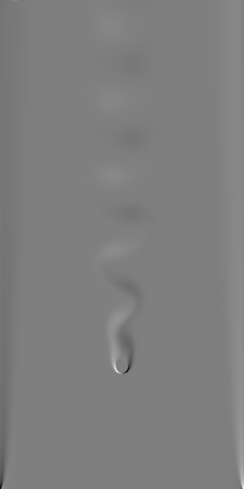
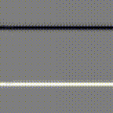
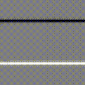

# LBM-Based 2D fluid solver



### How to run the code

Buid this project (We accpet most version of pytroch, but please ensure you have a CUDA env, CPU device is not acceptable for our repo.)

```bash
cd JRL-LBM
git submodule update --init --recursive
conda env create -f conda_env.yaml -n JRL-LBM
conda activate JRL-LBM
conda install pytorch torchvision torchaudio pytorch-cuda=11.8 -c pytorch -c nvidia
pip install -r requirements.txt
python setup.py build
```

Run demos

### Some small validations for fluid simulation

```bash
cd demo
python demo_2d_LBM.py
python demo_2d_LBM_KBC.py
python demo_2d_LBM_cylinder.py
```

### What you will see:





### Now start from the numerical validations from the paper:

### Validation 1: Does gravity / shape of obstacle matters?

```bash
cd demo
python batch_validation.py
python demo_plot_validation.py
```

### Validation 2: Approach curves in water

```bash
cd demo
python batch_validation.py --fluid water --is_negative
python demo_plot_water.py
```

### Trouble Shooting

- If you have met a problem on windows that 'cl' cannot be found, go into your Visual Studio and find it in `Microsoft Visual Studio\20xx\Community\VC\Tools\MSVC\xx.xx.xxxxx\bin\Hostx64\x64`, then add them into your environment path.
